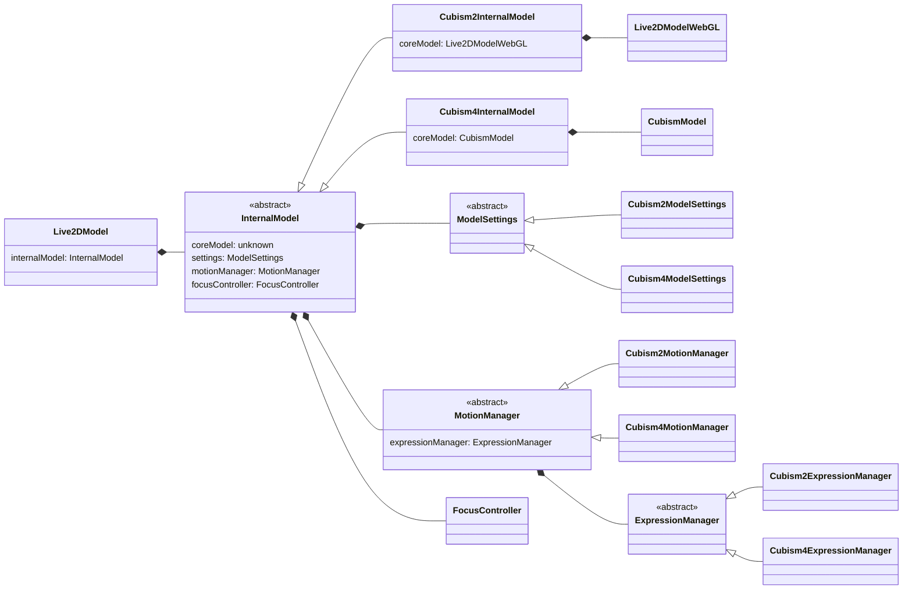
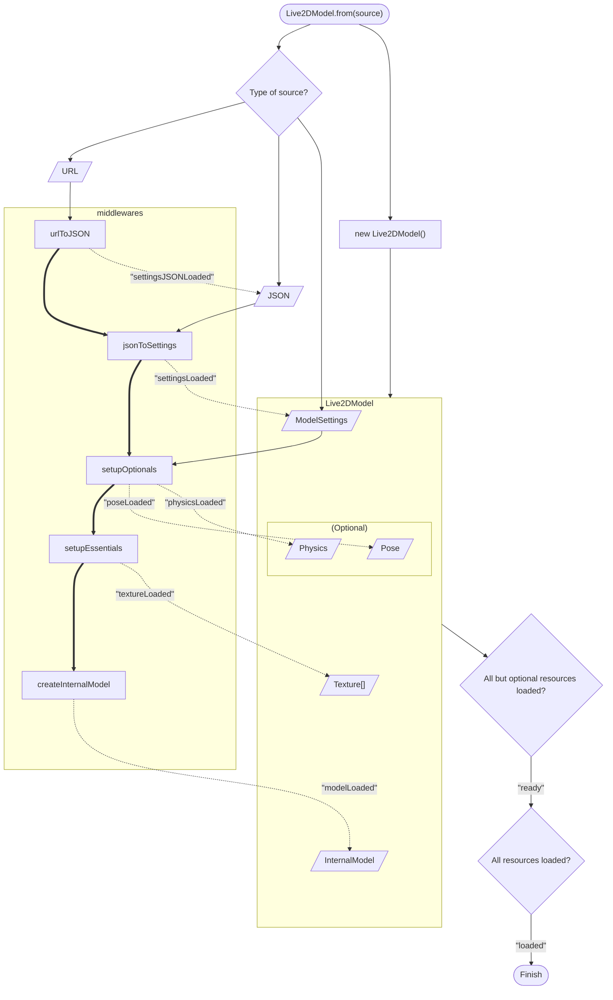

<style>
.cubism2 .nodeLabel, .cubism4 .nodeLabel {
  color: white !important;
}

.cubism2 > rect {
  fill: #2d8135 !important;
}

.cubism4 > rect {
  fill: #2849b1 !important;
}
</style>

## Class diagram

!!! tip
    Zoom in the webpage if diagram is too small.



## Creating model

Models can be created by an async method: `Live2DModel.from(source, options)`.

### Source

Source can be one of the following types:

-   A URL of the model settings file, which typically ends with `.model.json` (Cubism 2) or `.model3.json` (Cubism 3/4).

    ```js
    const model = await Live2DModel.from('path/to/shizuku.model.json');
    ```

-   A JSON object of the model settings. Note that you still need to specify the URL by a `url` property of the JSON object, it's for the resource loaders to know where to load files from.

    ```js
    const url = 'path/to/shizuku.model.json';
    const json = await fetch(url).then((res) => res.json());

    json.url = url;

    const model = await Live2DModel.from(json);
    ```

-   An instance of `ModelSettings`. Specifically, either `Cubism2ModelSettings` or `Cubism4ModelSettings`.

    ```js
    const url = 'path/to/shizuku.model.json';
    const json = await fetch(url).then((res) => res.json());

    json.url = url;

    const settings = new Cubism2ModelSettings(json);
    const model = await Live2DModel.from(settings);
    ```

!!! note
    URL is required in all cases, because resource loaders rely on the model's URL to resolve its resource files. For example, for a model with URL `path/to/shizuku.model.json`, its texture image `textures/01.png` will be resolved to `path/to/textures/01.png`.

### Options

`options` is a combination of the options for multiple components, see [Live2DFactoryOptions](https://guansss.github.io/pixi-live2d-display/interfaces/index.live2dfactoryoptions.html).

## Creating model synchronously

In case you want to participate in the creation, there's a synchronous creation
method: `Live2DModel.fromSync(source, options)`.

This method immediately returns a `Live2DModel` instance, whose resources have **not** been loaded yet. That means you can't manipulate or render this model - until the `load` event has been emitted.

```js
// no `await` here since it's not a Promise
const model = Live2DModel.fromSync('shizuku.model.json', { onError: console.warn });

// these will cause errors!
// app.stage.addChild(model);
// model.motion('tap_body');

model.once('load', () => {
    // now it's safe
    app.stage.addChild(model);
    model.motion('tap_body');
});
```

With this method, you're able to do extra works when certain resources have been loaded.

```js
const model = Live2DModel.fromSync('shizuku.model.json');

model.once('settingsJSONLoaded', (json) => {
    // e.g. customize the layout before it's applied to the model
    json.layout = {
        ...json.layout,
        width: 2,
        height: 2,
    };
});

model.once('settingsLoaded', (settings) => {
    // e.g. set another URL to the model
    settings.url = 'alternative/path/to/model';
});
```

When all essential resources have been loaded, a `ready` event is emitted. Then it's safe to render this model if you want it to show up as soon as possible.

After that, when all resources, including the optional resources, have been loaded, a `load` event is emitted.

```js
const model = Live2DModel.fromSync('shizuku.model.json');

model.once('ready', () => {
    // now it's safe to display the model, though not recommended because
    // it's likely to look weird due to missing optional resources
    app.stage.addChild(model);
    model.motion('tap_body');
});
```

The following diagram represents the procedure of model creation.



## Updating a model

To make a Live2D model "live", it needs to be updated at every frame. This is done by calling `model.update(deltaTime)` and there are two ways to do it.

### Updating automatically

This is the default behavior. Model will use `PIXI.Ticker.shared` to automatically update themselves.

The easiest way to achieve this is to import a full build of Pixi and expose `PIXI` to global scope, so that the model can access Ticker from `window.PIXI.Ticker`:

```js
import * as PIXI from 'pixi.js';

window.PIXI = PIXI;
```

Otherwise, you need to manually register the `Ticker` and `TickerPlugin`:

```js
import { Application } from '@pixi/app';
import { Ticker, TickerPlugin } from '@pixi/ticker';

Application.registerPlugin(TickerPlugin);
Live2DModel.registerTicker(Ticker);
```

### Updating manually

To manually update the model, you need to first disable the `autoUpdate` option, and then call `model.update(deltaTime)` at every frame.

Using Ticker:

```js
import { Ticker } from '@pixi/ticker';

const model = await Live2DModel.from('shizuku.model.json', { autoUpdate: false });

const ticker = new Ticker();

ticker.add(() => model.update(ticker.elapsedMS));
```

Using `requestAnimationFrame()`:

```js
const model = await Live2DModel.from('shizuku.model.json', { autoUpdate: false });

let then = performance.now();

function tick(now) {
    model.update(now - then);

    then = now;

    requestAnimationFrame(tick);
}

requestAnimationFrame(tick);
```
