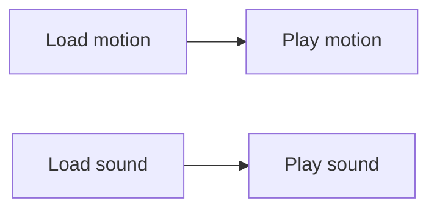
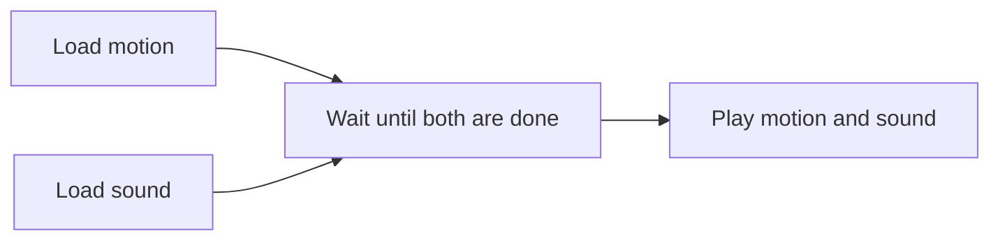

Motions are managed by the `MotionManager` of each model.

### Idle motions

When the model is not playing any motion, it's considered *idle*, and then its motion manager will randomly start an idle motion as "idle" priority.

Idle motions refer to the ones defined in a dedicated motion group: `"idle"` on Cubism 2, and `"Idle"` on Cubism 4. But you can specify a custom group to read idle motions from:

```js
model.internalModel.motionManager.groups.idle = 'main_idle';
```

You can also specify it when creating the model, in order to preload this group according to the preload strategy.

```js
const model = await Live2DModel.from('shizuku.model.json', { idleMotionGroup: 'main_idle' });
```

### Preloading motions

Motions are separate files and will be lazy loaded, so when you start a motion for the first time, it will be fetched from server. Depending on the network speed, this may cause a noticeable delay.

Motion preloading is here to help. It preloads motion during model creation to ensure motions can be played seamlessly (except for the first played motion because it may not have been loaded as soon as the model creation completes).

By default, only idle motions will be preloaded. You can change this by setting the `motionPreload` option.

```js
import { MotionPreloadStrategy } from 'pixi-live2d-display';

// MotionPreloadStrategy.ALL
// MotionPreloadStrategy.IDLE
// MotionPreloadStrategy.NONE

const model = await Live2DModel.from('shizuku.model.json', { motionPreload: MotionPreloadStrategy.NONE });
```

!!! caution
    Be careful of using `MotionPreloadStrategy.ALL`. Loading too many motions at the same time will send a lot of HTTP requests that may block the network from loading other resources due to the browser's concurrent connection limit.

### Starting Motions

```js
// start the first motion in "tap_body" group
model.motion('tap_body', 0);

// start a random motion in "tap_body" group
model.motion('tap_body');

// the above calls are shorthands of these methods
model.internalModel.motionManager.startMotion('tap_body', 0);
model.internalModel.motionManager.startRandomMotion('tap_body');
```

These methods return a `Promise` that resolves with `true` when the motion is successfully started, and `false` otherwise.

### Priorities

A motion can be started as one of these priorities: `IDLE`, `NORMAL` and `FORCE`.

`IDLE`: Low priority. Each model typically has a set of idle motions, which will be automatically played as such priority when the model is idle.

`NORMAL`: Medium priority. This is the default value if you don't provide one.

`FORCE`: High priority. This makes sure the motion will always be played regardless of the current priority, except for meeting a race condition where a subsequent motion with the same priority is loaded before this motion.

`NONE`: No priority. This cannot be assigned to a motion, it's internally used to represent the state that there's no any motion playing.

```js
import { MotionPriority } from 'pixi-live2d-display';

model.motion('tap_body', 0, MotionPriority.NORMAL);

// start a random motion
model.motion('tap_body', undefined, MotionPriority.NORMAL);
```

### State management

If a motion is requested to play when there's already another motion playing, then the current motion will not be canceled immediately, instead, the new motion *reserves* the place and starts to load, and the current motion will keep playing until the new motion has been loaded.

The actual rules are a bit more complicated, below is a state-transition table specifying that which motion will *eventually* be played when attempting to start a motion in a particular situation, assuming the loading will never fail and will be finished in a relatively short time.

<table>
<tr><th rowspan="2">When:</th><td colspan="4">Start motion C as:</td></tr>
<tr>
<td><code>NONE</code></td>
<td><code>IDLE</code></td>
<td><code>NORMAL</code></td>
<td><code>FORCE</code></td>
</tr>
<tr>
<th>Playing none 
<br>Reserved none </th>
<td align="center">none</td><td align="center">C</td><td align="center">C</td><td align="center">C</td>
</tr>
<tr>
<th>Playing A  as <code>IDLE</code> 
<br>Reserved none </th>
<td align="center">A</td><td align="center">A</td><td align="center">C</td><td align="center">C</td>
</tr>
<tr>
<th>Playing A  as <code>NORMAL</code> 
<br>Reserved none </th>
<td align="center">A</td><td align="center">A</td><td align="center">A</td><td align="center">C</td>
</tr>
<tr>
<th>Playing A  as <code>FORCE</code> 
<br>Reserved none </th>
<td align="center">A</td><td align="center">A</td><td align="center">A</td><td align="center">C</td>
</tr>
<tr>
<th>Playing A  as <code>IDLE</code> 
<br>Reserved B  as <code>NORMAL</code> </th>
<td align="center">B</td><td align="center">B</td><td align="center">B</td><td align="center">C</td>
</tr>
<tr>
<th>Playing A  as <code>NORMAL</code> 
<br>Reserved B  as <code>FORCE</code> </th>
<td align="center">B</td><td align="center">B</td><td align="center">B</td><td align="center">C</td>
</tr>
<tr>
<th>Playing A  as <code>FORCE</code> 
<br>Reserved B  as <code>FORCE</code> </th>
<td align="center">B</td><td align="center">B</td><td align="center">B</td><td align="center">C</td>
</tr>
<tr>
<th>Playing none 
<br>Reserved B  as <code>IDLE</code> </th>
<td align="center">B</td><td align="center">B</td><td align="center">C</td><td align="center">C</td>
</tr>
<tr>
<th>Playing none 
<br>Reserved B  as <code>FORCE</code> </th>
<td align="center">B</td><td align="center">B</td><td align="center">B</td><td align="center">C</td>
</tr>
<tr>
<th>Playing none 
<br>Reserved B  as <code>FORCE</code> </th>
<td align="center">B</td><td align="center">B</td><td align="center">B</td><td align="center">C</td>
</tr>
</table>

Note that these rules are different with Live2D's official samples in some cases:

- Race conditions will be correctly handled.
- Playing motions in parallel is not yet supported.

### Sounds

If the motion is specified with a sound file, it'll be played together with this motion.

`<audio>` elements are all managed by the singleton `SoundManager`. During playback, you can access those audios from `SoundManager.audios`.

You can also set a global volume to all active audios, and it will also affect audios created in the future.

```js
import { SoundManager } from 'pixi-live2d-display';

SoundManager.volume = 0.5;
```

To handle the audios separately, you can listen for the `motionStart` event.

```js
model.internalModel.motionManager.on('motionStart', (group, index, audio) => {
  if (audio) {
    // e.g. show subtitle for this audio
    showSubtitle(group, index);

    audio.addEventListener('ended', () => dismissSubtitle());
  }
});
```

### Motion Sync

There are two concurrent tasks while starting a motion with sound:



This can easily cause the sound to be out of sync with the motion because they are not always going to be loaded at the same time.

With motion sync, playbacks will be deferred until both the motion and sound have been loaded, looking like this:



This feature is enabled by default and can be toggled via [global config](../configs).

## Expressions

Expressions are managed by `ExpressionManager` inside `MotionManager`.

```javascript
// apply the first expression
model.expression(0);

// apply the expression named "smile"
model.expression('smile');

// when the argument is omitted, it applies a random expression
model.expression();

// the above calls are shorthands of these methods
model.internalModel.motionManager.expressionManager.setExpression(0);
model.internalModel.motionManager.expressionManager.setExpression('smile');
model.internalModel.motionManager.expressionManager.setRandomExpression();
```

!!! caution
    If a model has no expression defined in its settings, `ExpressionManager` will not be created at all, meaning that `model.internalModel.motionManager.expressionManager` is undefined.
